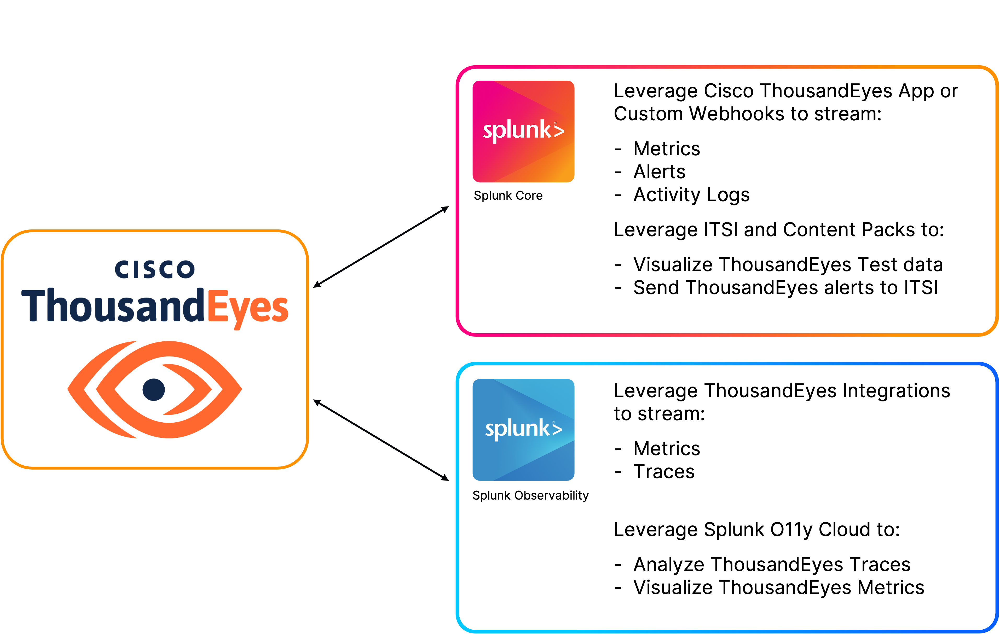

# Break Down Silos: Achieve Unified Observability with ThousandEyes and Splunk

Welcome to **"OBS1217 - Break Down Silos: Achieve Unified Observability with ThousandEyes and Splunk"** workshop

During this workshop you will learn about: 

- [**Visualizing the service map using distributed tracing in ThousandEyes**](service_map/basic/create_splunk_apm_integration.md)
- [**Streaming ThousandEyes data to Splunk Observability Cloud**](splunk_observability/create_metric_stream_to_splunk_observability.md)
- [**Streaming ThousandEyes data to the Splunk Platform**](splunk_core/create_logs_stream_to_splunk_core.md)
- [**Exploring the capabilities of the Cisco ThousandEyes App for Splunk**](thousandeyes_splunk_app/authenticate_thousandeyes_user.md)
- [**Monitoring ThousandEyes service health in Splunk ITSI**](splunk_itsi/itsi_initial_config.md)

