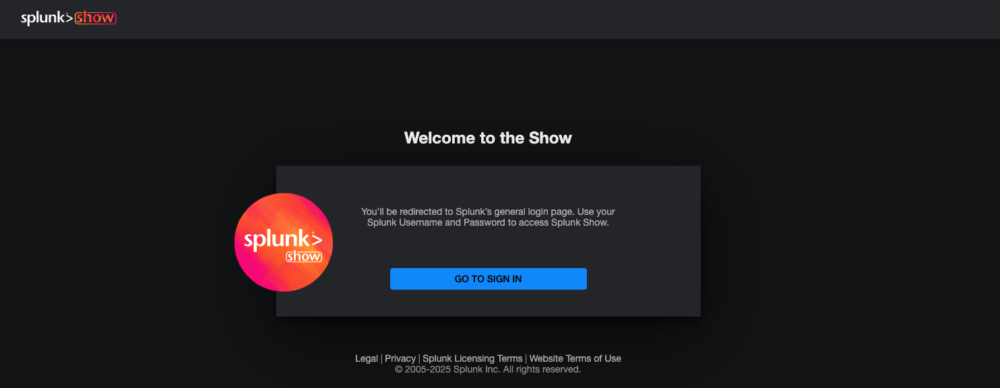
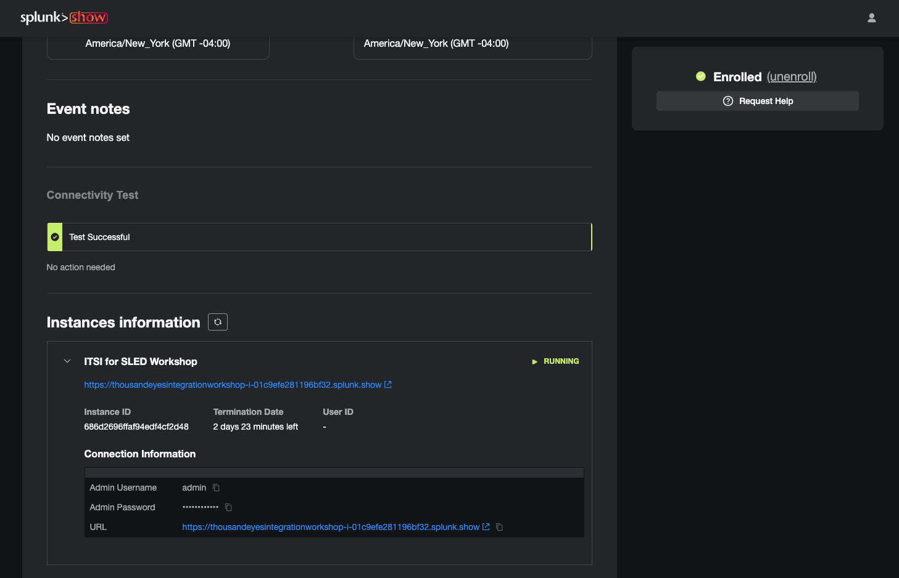

# Log In to Splunk Show Instance

This guide will help you log into your Splunk Show instance and copy the HEC token for the ThousandEyes stream.

Using Splunk Show

- Access the Splunk Show [https://splunk.show/te-splunk](https://show.splunk.com/)

- Sign in to `splunk.com` (Register if you don't have an account)
- Enroll event `ThousandEyes Integration Workshop`

- Once the event starts, you will see the instance information with the URL and credentials to access the Splunk instance

## Get Splunk HEC Token

HTTP Event Collector (HEC) tokens are required to send data to Splunk from external sources like ThousandEyes. A `ThousandEyesToken` is already created for the workshop.

- In Splunk Web, go to `Settings` in the top menu
- Click `Data Inputs` under the "Data" section
- Click `HTTP Event Collector`
- Open the existing `ThousandEyesToken`
- Copy the HEC token

## Identify HOST of your Splunk instance

- Splunk Enterprise: The host is typically the server name or IP address where Splunk is installed. For example, if you Splunk web page is `https://te-test-i-03af7829c8bab4176.splunk.show/en-GB/app/launcher/home`, your host will be: `te-test-i-03af7829c8bab4176.splunk.show`
