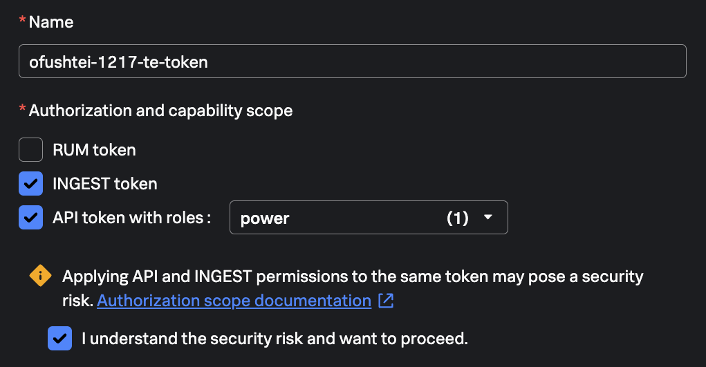
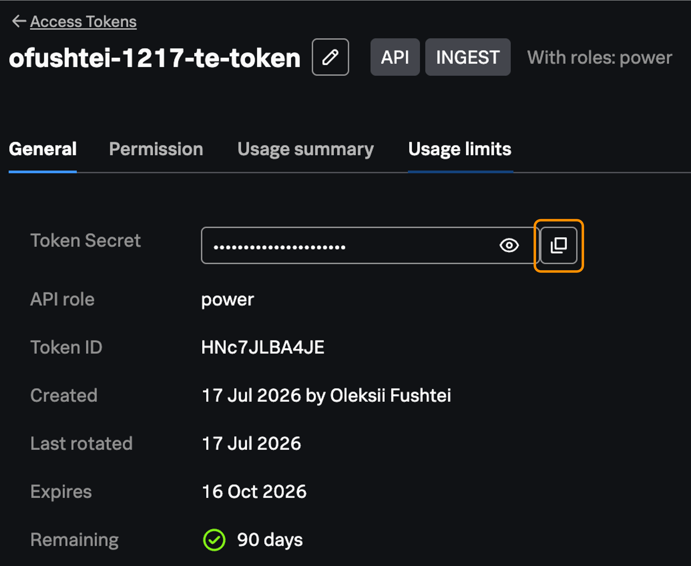

# Log In to Splunk Observability Cloud

This guide will help you log into Splunk Observability Cloud.

Use the workshop account to access Splunk Observability Cloud:

- Go to [Splunk Observability Cloud](https://app.us1.observability.splunkcloud.com/#/home).
- Enter the following credentials:
    - **Email**: `xxx`
    - **Password**: `xxx`
- Click `Sign In`

## Generate Access Token

Once you're logged into Splunk Observability Cloud, generate your access token:

- Navigate to the `Settings` -> `Access Tokens`
- On the top right Click `Create Token`
- Configure the token:
    - `Name`: Enter a unique descriptive name that includes your participant number of your initials to avoid conflicts with other participants
    - `Authorization and capability scope`: Select `INGEST` and `API` with the `power` role 
        - Check `I understand the security risk and want to proceed.`

- Click `Next` to proceed the `Permissions` section
- Keep the default permissions settings
- Click `Next` to proceed the `Expiration` section
- Keep the default `Expiration` settings
- Click `Create Token`

## Copy Your Access Token

To copy your token:
- Choose your token from the list
- Click `Copy` next to the `Token Secret`

