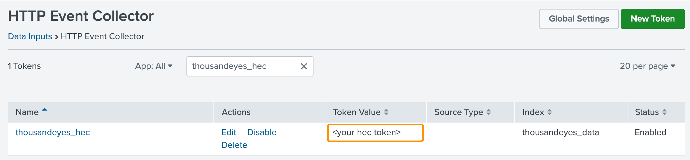

# Log In to Splunk Show Instance

This guide will help you log into your Splunk Show instance and copy the HEC token for the ThousandEyes stream.
- Access the Splunk Show [https://splunk.show/te-splunk](https://show.splunk.com/)

!!! TODO !!!

- Sign in to `splunk.com` (Register if you don't have an account)
- Enroll event `XXX`

- Once the event starts, you will see the instance information with the URL and credentials to access the Splunk instance

## Find your HEC Token

We will use HTTP Event Collector (HEC) to get data from Thousand eyes. A token is already created for the workshop.

- In Splunk Web, go to `Settings` in the top menu
- In the `Data` section, click `Data inputs`
- Select `HTTP Event Collector`
- Find the existing `thousandeyes_hec` token and copy the token value

## Identify HOST of your Splunk instance

The host is typically the server name or IP address where Splunk is installed.
For example, if you Splunk web page is `https://conf26-obs1217-001.splunk.show`, your host will be: `conf26-obs1217-001`
