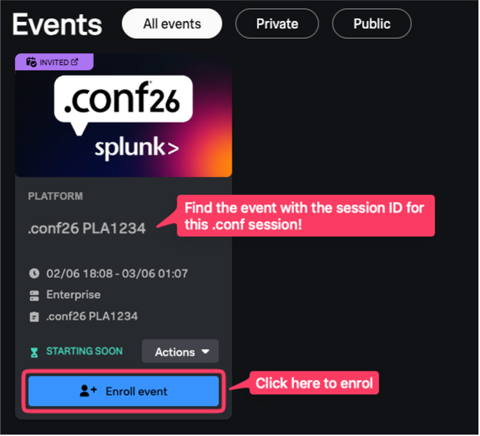
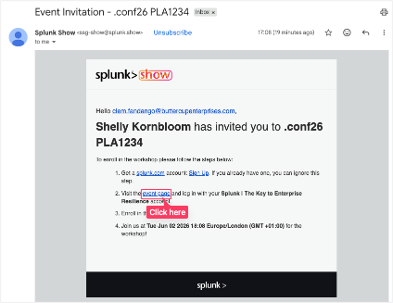
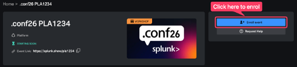
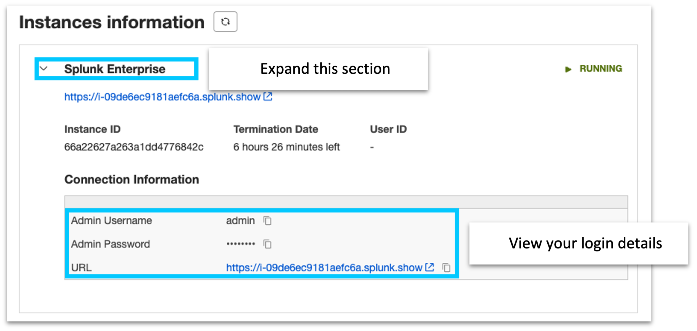

# Access your Splunk Show Instance

This guide will help you log into your Splunk Show instance and copy the HEC token for the ThousandEyes stream.

## Prerequisites

Splunk’s hands-on workshops are delivered via the [Splunk Show](https://show.splunk.com/) portal - you will need a splunk.com account in order to access this.

If you don’t already have a Splunk.com account, please create one [here](https://www.splunk.com/en_us/sign-up.html) before proceeding with the rest of the workshop.

## Login to Splunk Show

You should have received an invite email from Splunk Show containing a link to a workshop event `https://splunk.show/…`

❌ If you DON'T have an email from Splunk Show:

1.	Please check your spam folder.
2.	If you still can’t find the email please visit https://show.splunk.com and log in with your `splunk.com` account. 
3.	Find the event for this session (look for the session ID - OBS1217) and click on `Enroll event`.

✅ If you DO have an email from Splunk Show:

1.	Open the email and click on the event link.

2.	On the Welcome to the Show page click on `GO TO SIGN IN` and log in using your Splunk.com account.

3.	Once logged in you should see the event page. Click on `Enroll event`.

## Finding Your Instance Details

1.	Scroll down the page to the `Instances information` section. Here you will find information on how to access your environment along with the login details. 

## Find your HEC Token

We will use HTTP Event Collector (HEC) to get data from Thousand eyes. A token is already created for the workshop.

- In Splunk Web, go to `Settings` in the top menu
- In the `Data` section, click `Data inputs`
- Select `HTTP Event Collector`
- Find the existing `thousandeyes_hec` token and copy the token value

## Identify HOST of your Splunk instance

The host is typically the server name or IP address where Splunk is installed.
For example, if you Splunk web page is `https://conf26-obs1217-001.splunk.show`, your host will be: `conf26-obs1217-001`
