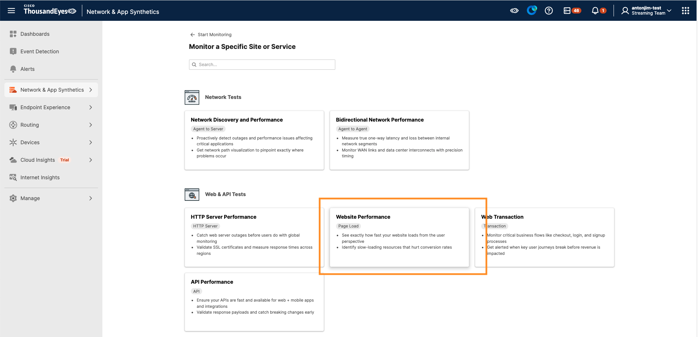
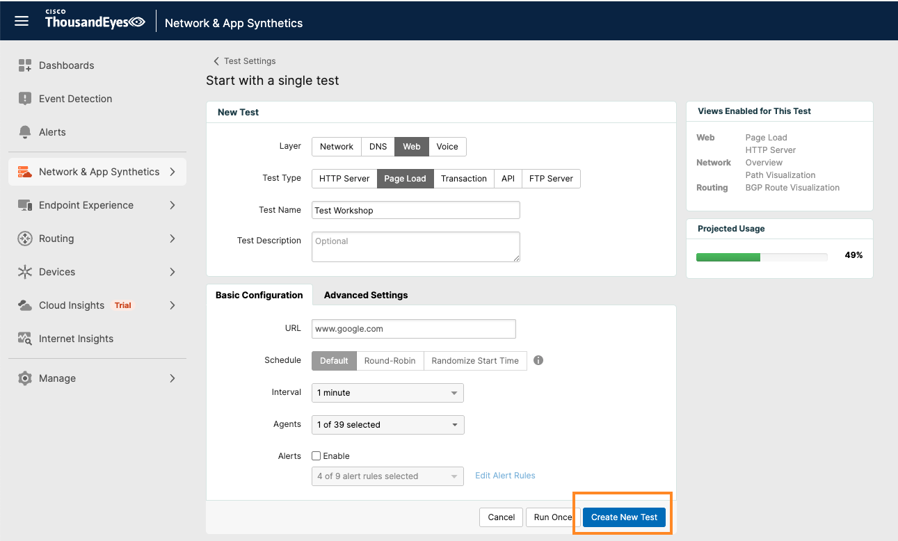

# ThousandEyes

## Log In to ThousandEyes

Use the workshop account to access ThousandEyes:

- Go to the [ThousandEyes Log In page](https://app.thousandeyes.com/login).
- Enter the following credentials:
    - **Email**: `antonjim+conf1@cisco.com`
    - **Password**: `antonjim+conf1@cisco.com`
- Click `Sign In`

## Create a ThousandEyes Page Load Test

For ThousandEyes to be able to stream data to Splunk, the data first needs to be collected by ThousandEyes. To achieve this, we need to create a ThousandEyes test.
Refer to [ThousandEyes documentation](https://docs.thousandeyes.com/product-documentation/tests) for test creation.

We are going to create a `Page Load` test that validates the availability of `www.google.com`.

!!! note "Skip Test Creation if Already Created"
    In case you already have a `Page Load` test created, you can skip this step and use the existing test.

### Create a Test via UI

- Click on `Network & App Synthetics` in the left navigation bar
- Select `Test Settings` from the dropdown menu
- Click the `+ Add New Test` button
- Select `Page Load` from the test type options

- Configure Test Settings
    - `Test Name`: Enter a descriptive name that includes your seat number (e.g., `Test - Seat 12`)
    - `URL`: Enter `https://www.google.com`
    - In the `Agents` section, select a Cloud Agent
- Click `Create New Test`

### Remember your test name

When configuring streams later in the workshop, you will select your test **by name** in the ThousandEyes UI. You do not need the Test ID.

- Use the same **test name** you entered when creating the test
- Keep your **seat number** in the name so you can identify your data in the shared Splunk Observability dashboard
