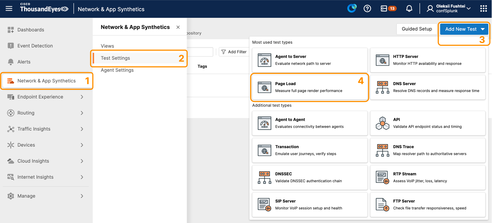
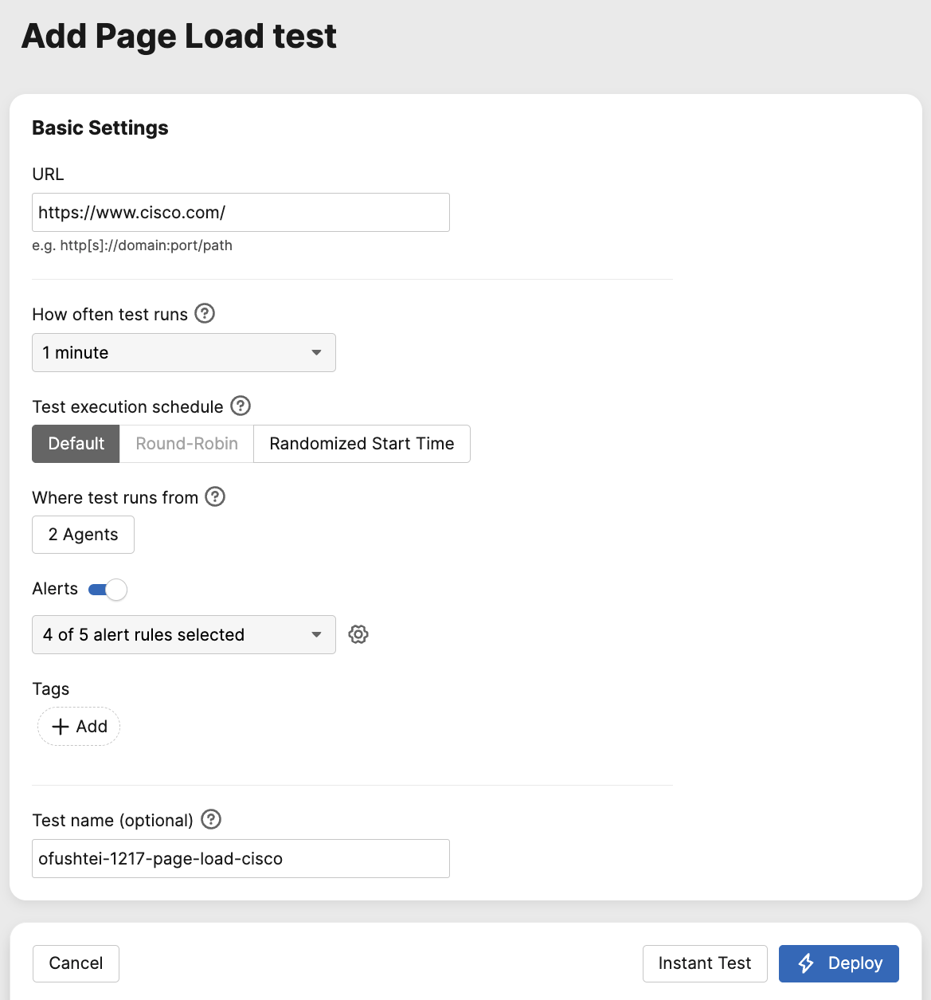

# ThousandEyes

## Log In to ThousandEyes

Use the shared [ThousandEyes workshop credentials spreadsheet](https://cisco-my.sharepoint.com/:x:/p/antonjim/IQDgi_SAY4ZhR7fAsmQakSbpAbHZA_KhqGCfyOus7eafp5k?e=PLOcU2) to obtain your credentials. If prompted, sign in with your Cisco account.

1. Find a row where the **Taken By** column is empty.
2. Enter your full name in **Taken By** to claim that row before using its credentials.
3. Copy the **User Name** and **Password** from the same row.
4. Go to the [ThousandEyes Log In page](https://app.thousandeyes.com/login).
5. Enter the copied **User Name** in the **Email** field and enter the copied **Password**.

!!! warning "Claim only one account"
    Do not use a row already claimed by another participant. Do not change the **Account Name**, **User Name**, or **Password** values in the spreadsheet.

## Create a ThousandEyes Page Load Test

For ThousandEyes to be able to stream data to Splunk, first it needs to be collected by ThousandEyes. To achieve this, we need to create a ThousandEyes test.

For this exercise, we are going to create a `Page Load` test that checks the availability and performance of `www.cisco.com` page.
To learn more about Page Load tests, check the [Page Load Test documentation](https://docs.thousandeyes.com/product-documentation/tests/web-layer-tests#page-load-test)

### Create a Test

- Click on `Network & App Synthetics` in the left navigation bar
- Select `Test Settings`
- Click the `Add New Test`
- Select `Page Load` from the test type options

### Configure Test

For this workshop, we will need only the Basic section:

- **URL**: Enter `https://www.cisco.com/`
- **Frequency**: Leave it at 1 minute
- **Test location**: Click `Select Agents` and select 1 or 2 _Cloud Agents_ (e.g., Denver and Edinburgh)
- **Alerts**: All enabled
- **Test Name**: Enter a unique descriptive name that includes your participant number or your initials
- Click `Deploy`

