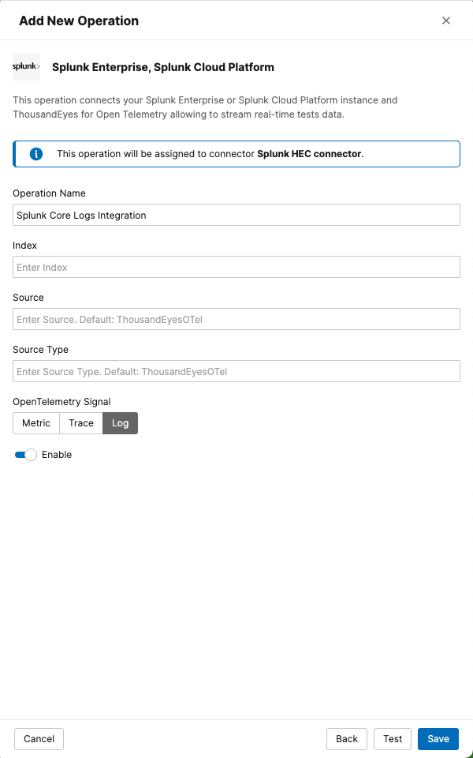

# Create a Logs Stream on ThousandEyes for Splunk Core

Use the ThousandEyes web interface to create the integration manually using Integrations 2.0.

- Navigate to `Manage` > `Integrations` > `Integrations 2.0`

## Create a Connector

- Click `+ New Connector` to select the type of connector to configure
    - Splunk Enterprise: `Splunk Enterprise HEC`
- Configure Connector Settings    
    - `Name`: A name for your connector (e.g., "Splunk Core Integration")
    - `Target`: The target URL of the integration: `https://<host>:8088/services/collector/event`
    - `Token`: Enter your Splunk HEC token
- Click `Save & Assign Operation` to save the connector

## Create an Operation

- Click `+ New Operation` to open the menu for selecting the operation type
- Choose `Splunk Enterprise, Splunk Cloud Platform` to proceed to the configuration form
- Configure Operation Settings
      - `Operation Name`: A name for your operation (e.g., "Splunk Core Logs Integration")
      - `Signal`: `logs`
- Click `Save`

!!! note "Data Flow Timing"
    The stream will begin sending data to your Splunk instance within a few minutes of activation.

## Configure integration from the Splunk platform

To see if the same configuration is possible from the Splunk interface, head over to \[[Configure ThousandEyes App](../thousandeyes_splunk_app/authenticate_thousandeyes_user.md)\] to learn how to set it up using the ThousandEyes App for Splunk.

