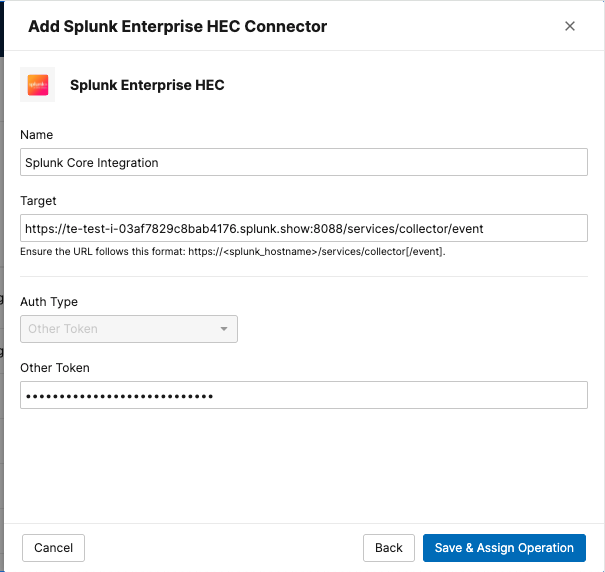
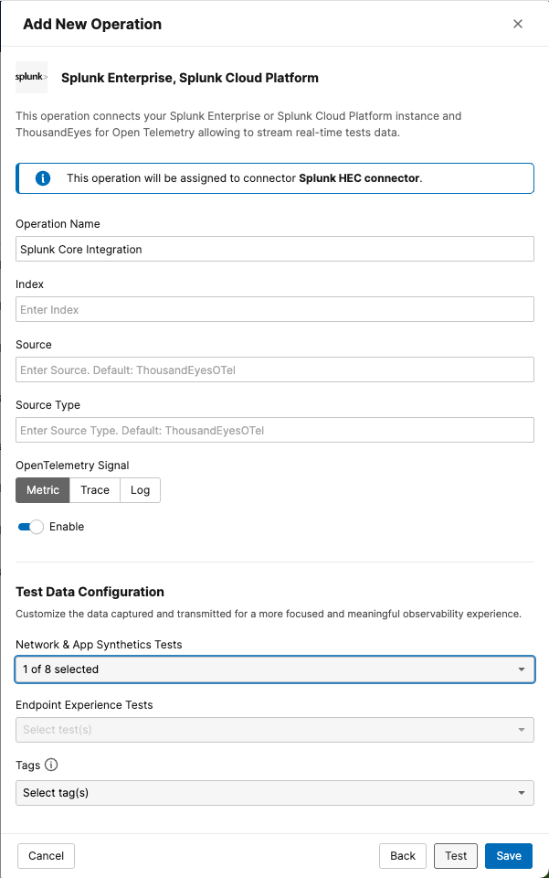

# Create a Metrics Stream on ThousandEyes for Splunk Cloud Platform or Splunk Enterprise

Use the ThousandEyes web interface to create the integration manually using Integrations 2.0.

- Navigate to `Manage` > `Integrations` > `Integrations 2.0`

### Create a Connector

- Click `+ New Connector` to select the type of connector to configure
    - Splunk Cloud Platform: `Splunk Cloud Platform HEC`
    - Splunk Enterprise: `Splunk Enterprise HEC`
- Configure Connector Settings    
    - `Name`: A name for your connector (e.g., "Splunk Core Integration")
    - `Target`: The target URL of the integration:
        - `Splunk Cloud Platform`: `https://http-inputs-<host>.splunkcloud.com:443/services/collector/event`
        - `Splunk Enterprise`: `https://<host>:8088/services/collector/event`
    - `Token`: Enter your Splunk HEC token
- Click `Save & Assign Operation` to save the connector

### Create an Operation

- Click `+ New Operation` to open the menu for selecting the operation type
- Choose `Splunk Enterprise, Splunk Cloud Platform` to proceed to the configuration form
- Configure Operation Settings
      - `Operation Name`: A name for your operation (e.g., "Splunk Core Metrics Integration")
      - `Signal`: `metric`
      - `Network & App Synthetics Tests`: Select the created test.
- Click `Save`

!!! note "Data Flow Timing"
    The stream will begin sending data to your Splunk instance within a few minutes of activation.
