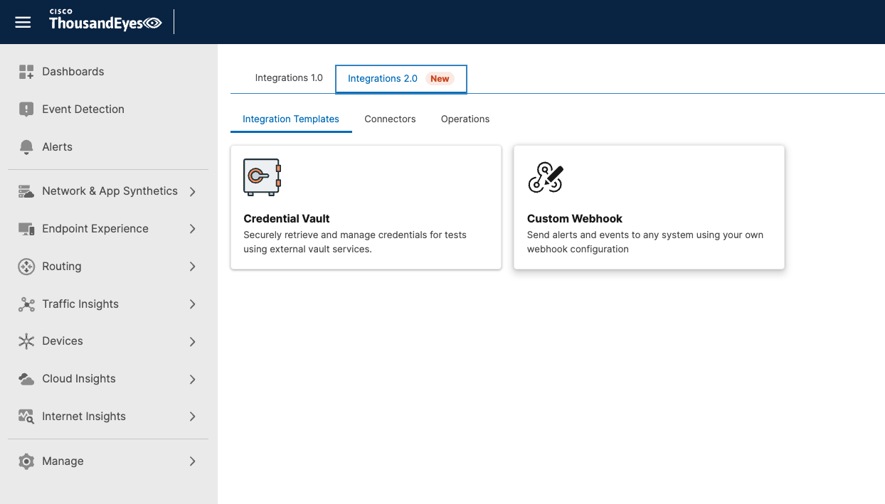
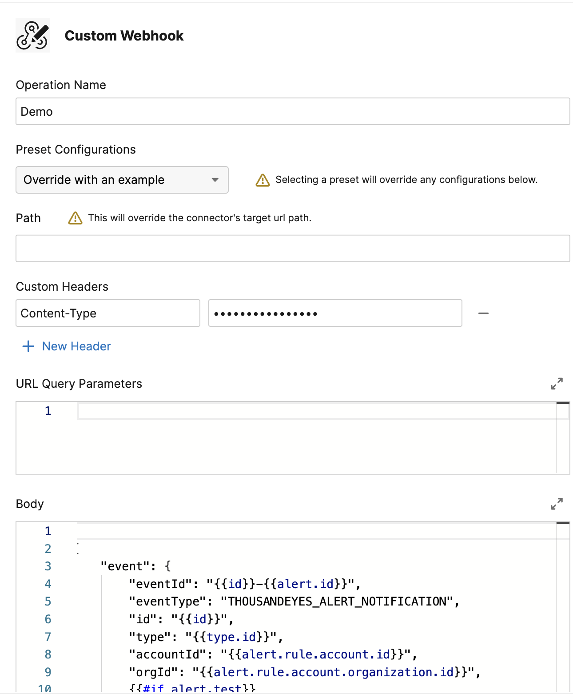
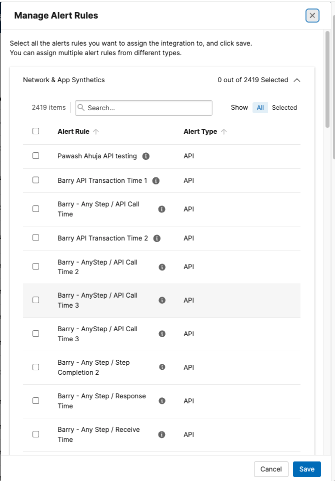
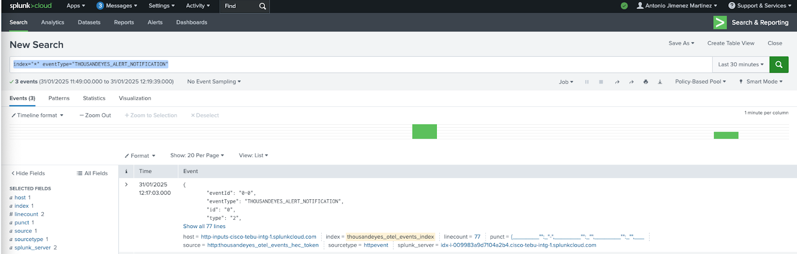

# Stream ThousandEyes Alerts to Splunk Core

This guide shows how to send ThousandEyes alert notifications to Splunk Core using a **Custom Webhook** integration.

## Create a Custom Webhook connector

- Navigate to `Manage` > `Integrations` > `Integrations 2.0` > `Integration Templates`
- Select **Custom Webhook**



- Configure the connector:
    - `Name`: a descriptive name (e.g., `Splunk Alerts`)
    - `Target`: `https://<host>:8088/services/collector/event`
    - `Auth Type`: **Custom**
    - `Custom Headers`: `Authorization: Splunk <HEC Token>`
- Click **Save & Assign Operation**

## Create the operation

- `Operation Name`: a descriptive name (e.g., `Splunk Alerts Integration`)
- `Preset Configurations`: **Splunk**
- `Custom Headers`: `Content-Type: application/json`
- Review the Splunk preset payload in the **Body** field
- Click **Test** to verify the integration
    - If the test succeeds, ThousandEyes displays a confirmation message
    - If the test fails, verify the HEC target, token, headers, and payload
- Click **Save Integration**



## Attach alert rules

- Navigate to `Manage` > `Integrations` > `Integrations 2.0` > `Operations`
- Find your Splunk custom webhook operation
- Click the actions menu at the end of the row, then select **Manage Alert Rules**
- Select the alert rules you want to send to Splunk
- Click **Save**



## Validate alerts in Splunk Core

When an alert is triggered, search for the event in Splunk Core:

```
index="*" eventType="THOUSANDEYES_ALERT_NOTIFICATION"
```

Key fields to review:

- `eventType`: `THOUSANDEYES_ALERT_NOTIFICATION`
- `thousandeyes_test_id`
- `test_description`
- `alert`


