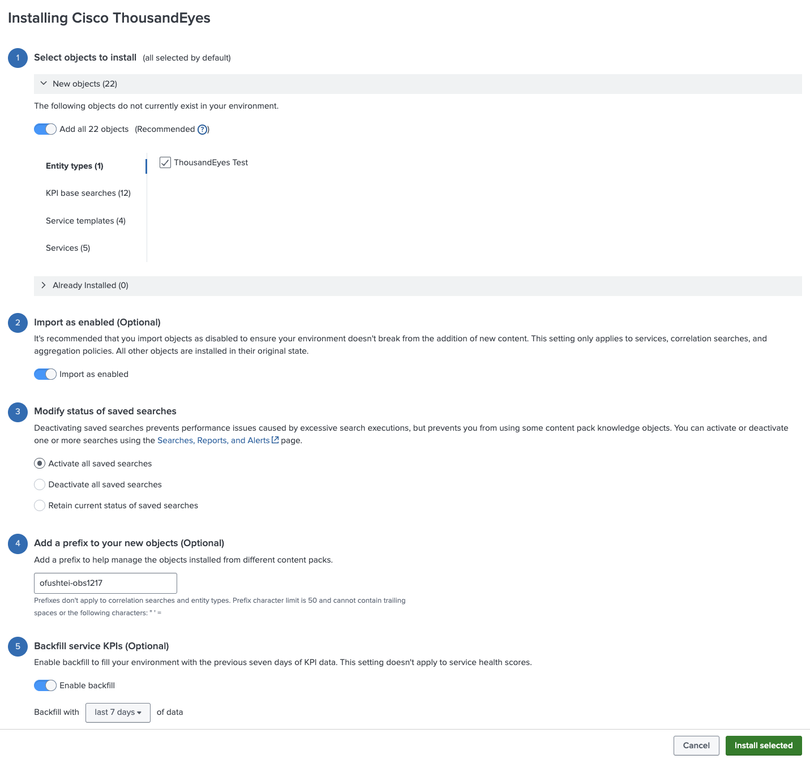
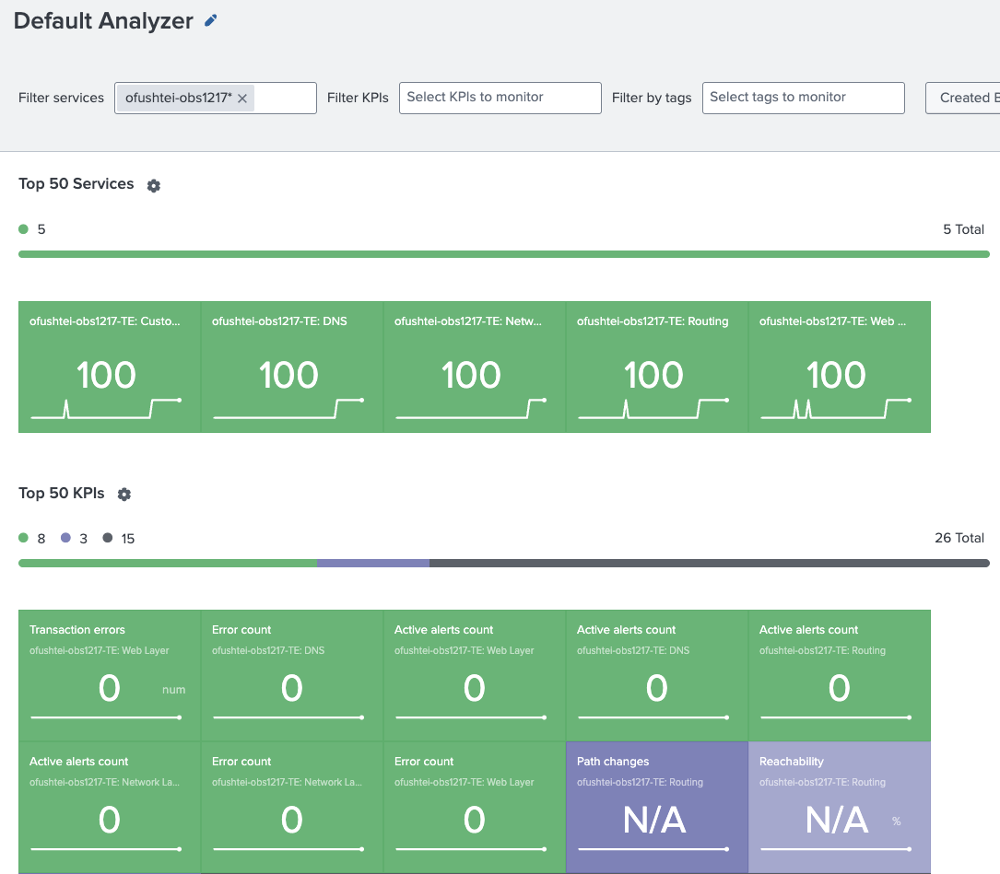

# Stream ThousandEyes Test Data to Splunk ITSI

## Prerequisites

By default, this integration expects you to ingest ThousandEyes Metrics via Cisco ThousandEyes App.

If you didn't complete this by now, please follow the [workshop guide](../thousandeyes_splunk_app/create_test_metric_stream_input.md) or [official documentation](https://docs.thousandeyes.com/product-documentation/integration-guides/custom-built-integrations/splunk-app/itsi#stream-thousandeyes-test-data-to-splunk-itsi)

## Install and Configure content pack

To install and configure the Content Pack for Cisco ThousandEyes, do the following:

- Navigate to `ITSI` -> `Configuration` -> `Data Integratiions` -> `Content Library`
- Select `Cisco ThousandEyes` from the list
- Follow the steps from the official ThousandEyes documentation: [Splunk ITSI Integration # Install the Content Pack for Cisco ThousandEyes](https://docs.thousandeyes.com/product-documentation/integration-guides/custom-built-integrations/splunk-app/itsi#install-the-content-pack-for-cisco-thousandeyes)
    - Click `Proceed`
    - Add all objects (both `New` and `Already installed`)
    - Click `Import as enabled`
    - Click `Activate all saved searches`
    - Click `Backfill service KPIs`
    - Click `Install selected`
    - In the confirmation dialogue, click `Install`

## Validate installation

To validate your installation:

- Go to `Service Analyzer` -> `Default Analyzer`:
- Filter services by the prefix you specified during the configuration
- If you don't see results, try extending the time range

