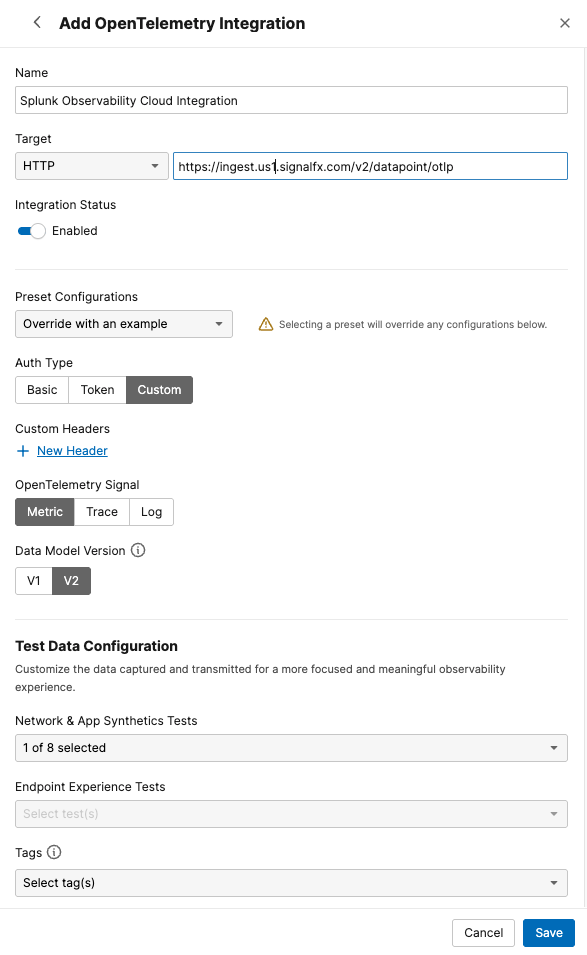

# Create a Metrics Streams on ThousandEyes for Splunk Observability Cloud

Use the ThousandEyes web interface to create the stream integration manually via OpenTelemetry.

To integrate Splunk Observability Cloud with ThousandEyes, follow these steps:

- Navigate to `Manage` > `Integrations` > `Integration 1.0`
- Click `+ New Integration` and select `OpenTelemetry Integration`

- Configure the integration settings:
    - Enter a `Name` for the integration (e.g., "Splunk Observability Cloud Metrics Integration")
    - Set the `Target` to `HTTP`
    - Enter the `Endpoint URL` to send data in `OTLP (OpenTelemetry Protocol)` format:
      ```
      https://ingest.us1.signalfx.com/v2/datapoint/otlp
      ```
    - For `Preset Configuration`, select `Splunk Observability Cloud`
    - For `Auth Type`, select `Custom`
    - Set the following `Custom Headers`:
        - `X-SF-Token: qc-VZhVaVARLKDPuhBJQfQ`
        - `Content-Type: application/x-protobuf`
    - Select `Metric` as the OpenTelemetry `Signal`
    - Select `v2` as the `Data Model Version`
    - For `Network & App Synthetic`, select a the test that you want to stream data from
- Click `Save`




!!! note "Receiving data"
    The stream will begin sending data to Splunk Observability Cloud in a couple of minutes.
