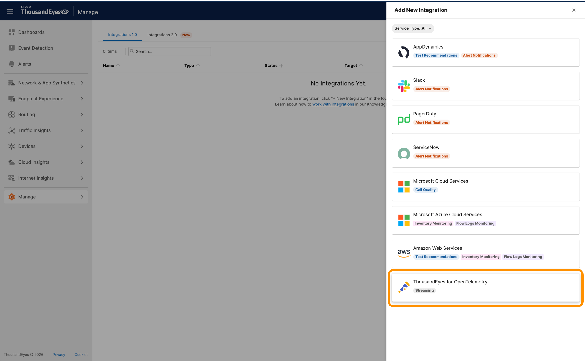
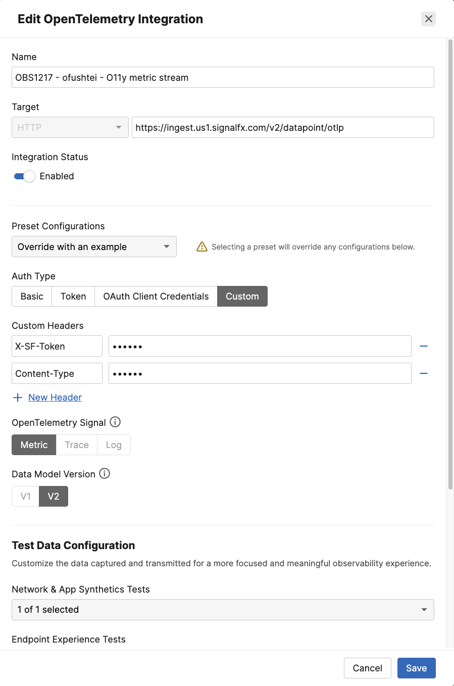

# Create ThousandEyes Metric Stream for Splunk Observability Cloud

To create a ThousandEyes Metric Stream for Splunk Observability Cloud, follow these steps:

- Navigate to `Manage` -> `Integrations` -> `Integrations 1.0`
- Click `+ New Integration` and select `ThousandEyes for OpenTelemetry`



- Configure the integration:
    - Enter a `Name` for the integration (e.g., "OBS1217 - ofushtei - O11y metric stream")
    - Set the `Target` to `HTTP`
    - Enter the `Endpoint URL` for sending OTLP (OpenTelemetry Protocol) data:

      ```
      https://ingest.us1.signalfx.com/v2/datapoint/otlp
      ```

    - From the `Preset Configuration` dropdown, select `Splunk Observability Cloud`
    - For `Auth Type`, select `Custom`
    - Set the following `Custom Headers`:
        - `X-SF-Token` to `qc-VZhVaVARLKDPuhBJQfQ`
        - `Content-Type` to `application/x-protobuf`
    - Select `Metric` as the `OpenTelemetry Signal`
    - Select `v2` as the `Data Model Version`
    - In the `Network & App Synthetic Tests` dropdown, select the test you created earlier
- Click `Save`



!!! note "Data may not be ready - Wait a few minutes" 
    Please note that it will take a couple of minutes for the metric stream to start, so while you wait, you can move on to the next topic.
