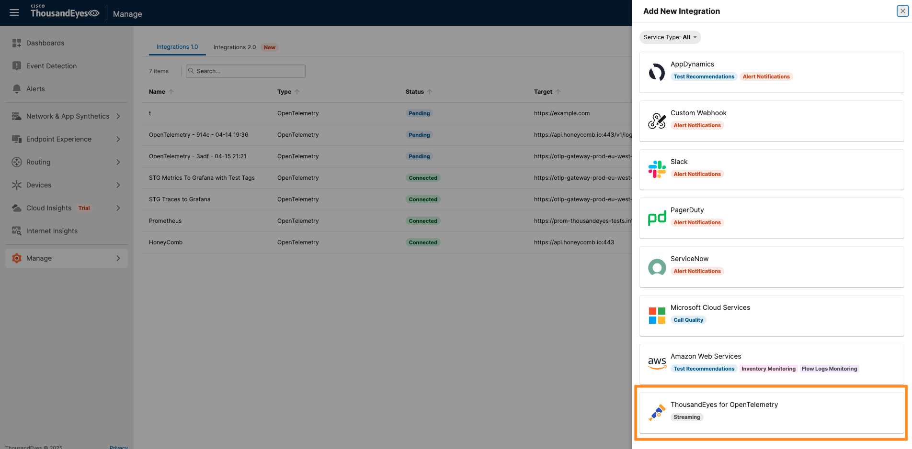
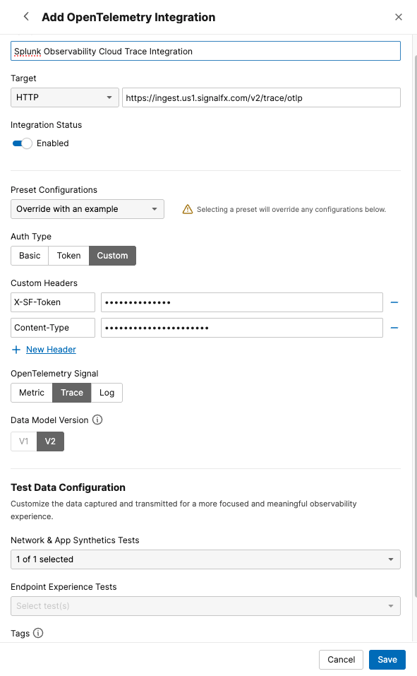

# Create a Trace Streams on ThousandEyes for Splunk Observability Cloud

Use the ThousandEyes web interface to create the trace stream integration manually via OpenTelemetry.

To integrate trace streaming from ThousandEyes to Splunk Observability Cloud, follow these steps:

- Navigate to `Manage` > `Integrations` > `Integration 1.0`
- Click `+ New Integration` and select `OpenTelemetry Integration`

- Configure the integration settings:
    - Enter a `Name` for the integration (e.g., "Splunk Observability Cloud Trace Integration")
    - Set the `Target` to `HTTP`
    - Enter the `Endpoint URL` to send trace data in `OTLP (OpenTelemetry Protocol)` format:
      ```
      https://ingest.us1.signalfx.com/v2/trace/otlp
      ```
    - For `Preset Configuration`, select `Splunk Observability Cloud`
    - For `Auth Type`, select `Custom`
    - Set the following `Custom Headers`:
        - `X-SF-Token: {TOKEN}`
            - Enter your Splunk Observability Cloud access token
        - `Content-Type: application/x-protobuf`
    - Select `Trace` as the OpenTelemetry `Signal`
    - Select `v2` as the `Data Model Version`
    - For `Network & App Synthetic`, select a the test that you want to stream data from
- Click `Save`



!!! note "Receiving trace data"
    The trace stream will begin sending distributed tracing data to Splunk Observability Cloud in a couple of minutes. You can view these traces in the APM section of Splunk Observability Cloud.
