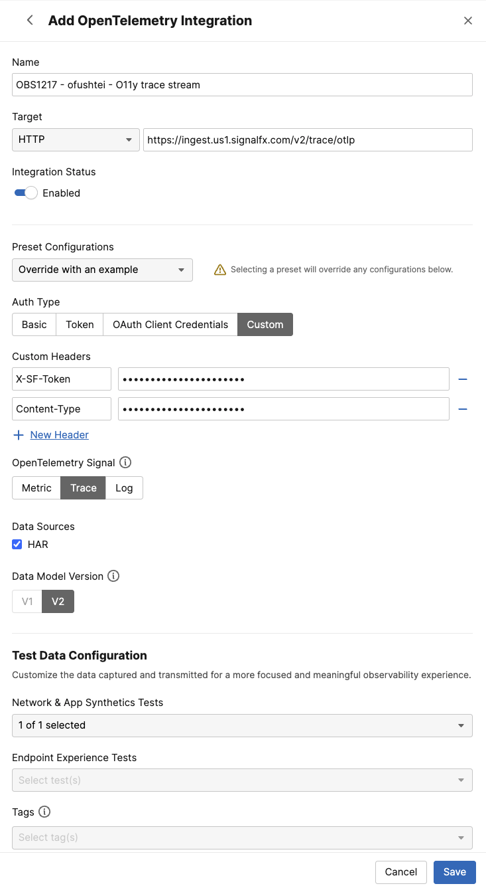

# Create a Trace Streams on ThousandEyes for Splunk Observability Cloud

To create a ThousandEyes Metric Stream Splunk, follow these steps:

- Navigate to `Manage` -> `Integrations` -> `Integration 1.0`
- Click `+ New Integration` and select `OpenTelemetry Integration`


- Configure the integration:
    - Enter a `Name` for the integration (e.g., "OBS1217 - ofushtei - O11y trace stream")
    - Set the `Target` to `HTTP`
    - Enter the `Endpoint URL` to send OTLP (OpenTelemetry Protocol) data to:

      ```
      https://ingest.us1.signalfx.com/v2/trace/otlp
      ```

    - For `Preset Configuration`, select `Splunk Observability Cloud`
    - For `Auth Type`, select `Custom`
    - Set the following `Custom Headers`:
        - `X-SF-Token: qc-VZhVaVARLKDPuhBJQfQ`
        - `Content-Type: application/x-protobuf`
    - Select `Trace` as the `OpenTelemetry Signal`
    - Select `v2` as the `Data Model Version`
    - In `Network & App Synthetic` dropdown, select the test you created earlier
- Click `Save`



Please note, it will take a couple of minutes for the trace stream to start. 
You can view traces in the APM section of Splunk Observability Cloud.
