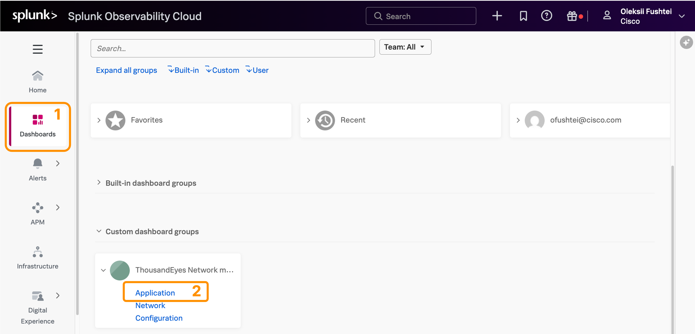
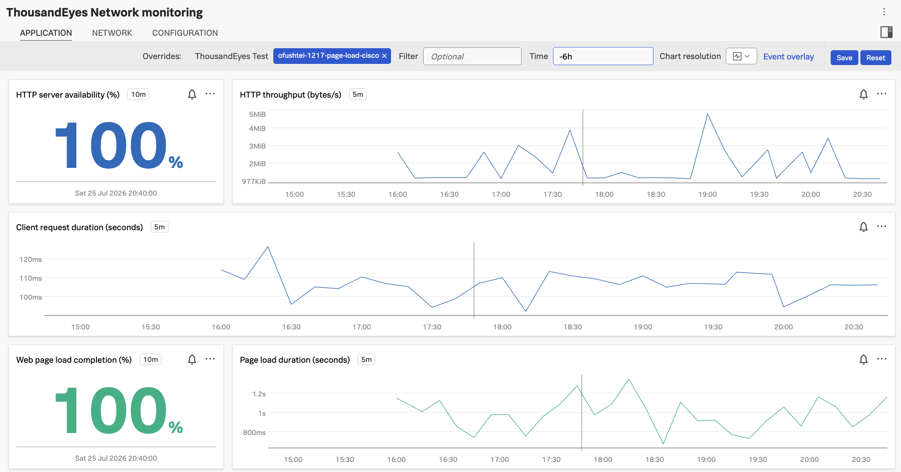
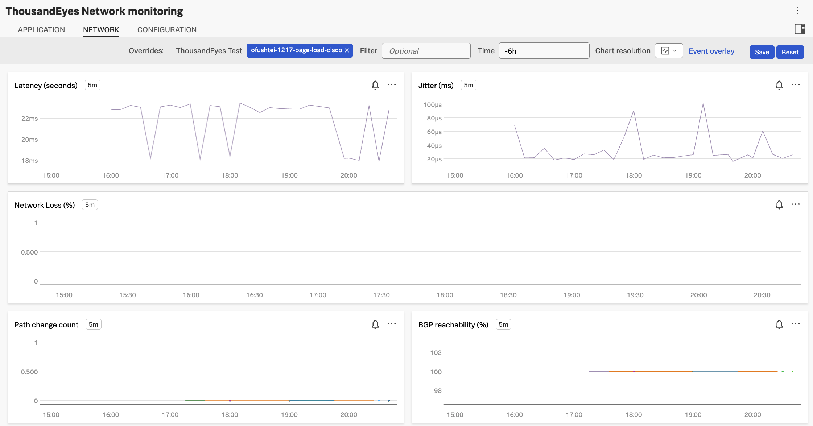

# Visualize ThousandEyes Metrics in Splunk Observability Cloud

## Navigate to the Network monitoring dashboard

The **ThousandEyes Network monitoring** dashboard is already created in the Splunk Observability Cloud instance.

- Log in to [Splunk Observability Cloud](../getting_started/login_splunk_observability.md)
- From the landing page, navigate to `Dashboards`
- In `Custom dashboard groups`, click on `ThousandEyes Network monitoring` and select `Application` from the dropdown

## Visualize your test data

Other participants share the same Splunk Observability Cloud environment, so make sure you are viewing metrics for **your** ThousandEyes test only.

- Once the dashboard is loaded, enter the test name in the `ThousandEyes Test` field
- Use the **ThousandEyes test name** you chose when creating your Page Load test

If you don't see data immediately, just wait a few minutes. Telemetry needs to be generated and sent to Splunk.

**Application dashboard**

**Network dashboards**

## Next steps

From this point on, you are free to explore the workshop at your own pace, focusing on the topics of your choice:

- If you wish to continue exploring the ThousandEyes & Splunk O11y integration, head over to: [Create Trace Stream to Splunk O11y](../splunk_observability/create_trace_stream_to_splunk_observability.md)
- To explore how to stream ThousandEyes data to Splunk Core via the official ThousandEyes app, go to: [Configure ThousandEyes App](../thousandeyes_splunk_app/authenticate_thousandeyes_user.md)
- To discover how to stream data via OpenTelemetry directly from the ThousandEyes platform, go to: [Link/Section](../splunk_core/create_logs_stream_to_splunk_core.md)

**We're here if you need us!**