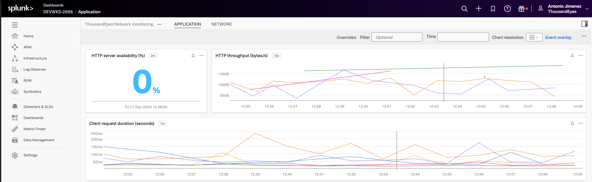
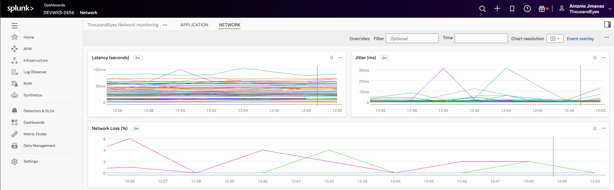

# Visualize ThousandEyes Metrics in Splunk Observability Cloud

## Open the dashboard

The ThousandEyes metrics dashboard is already created in the workshop Splunk Observability Cloud instance. You do not need to import it.

!!! note "Dashboard improvement tracked"
    A filter to select each participant's ThousandEyes test name is planned. Track progress in [GitHub issue #1](https://github.com/ajimenez1503/splunk.conf-2026-OBS1217/issues/1).

- Log in to the [workshop Splunk Observability Cloud instance](../../getting_started/login_splunk_observability.md)
- In the initial page of Splunk Observability Cloud, navigate to `Dashboards`

- In `Custom dashboard groups`, expand `ThousandEyes Dashboard` and select `Application`

## Visualize only your test data

Participants share the same Splunk Observability environment, so make sure you are viewing metrics for **your** ThousandEyes test only.

- Use the **test name** you chose when you created your Page Load test in [ThousandEyes](../../getting_started/thousandeyes.md)
- Include your **seat number** in the test name (for example, `Test - Seat 12`) so you can identify your data among other participants
- When the dashboard test-name filter is available, select your test name from the filter before reviewing the panels
- Until that filter is available, verify that the charts and values correspond to your test name and ignore data from other participants' tests

!!! note "Data may not be ready - Wait a few minutes"
    The telemetry needs to be generated by the application and sent to Splunk. This may take a few minutes.

