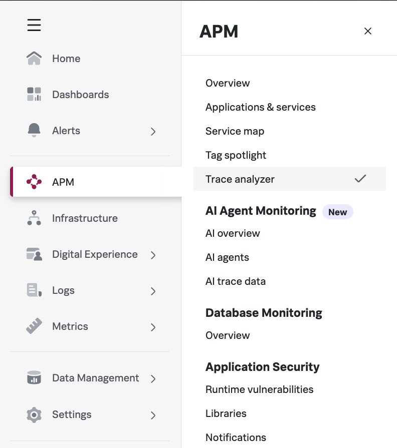
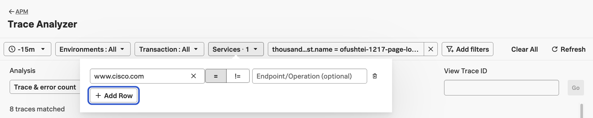
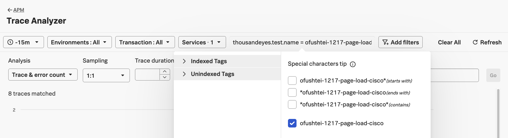
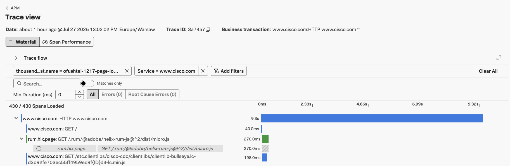
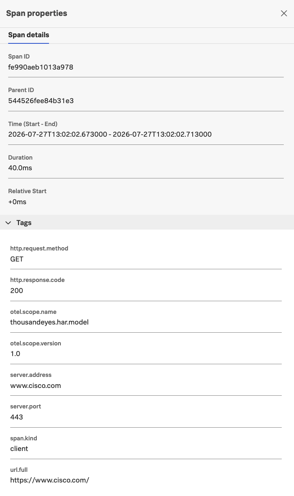
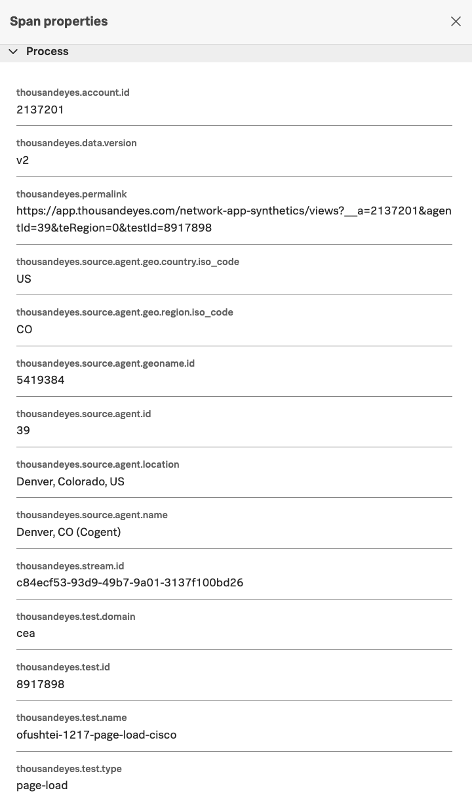

# Visualize ThousandEyes Page Load HAR as a trace in Splunk Observability Cloud 

## Navigate to the APM page

- Log in to the [Splunk Observability Cloud](../getting_started/login_splunk_observability.md)
- From the landing page, navigate to `APM` -> `Trace Analyzer`

- Filter by `Services` and enter the service you configured your test for
    - For example, `www.cisco.com` or `*cisco*`

- Click Add Filters and create a filter `thousandeyes.test.name = <your-test-name>` 
    - For example, `thousandeyes.test.name = ofushtei-1217-page-load-cisco`

- Click on the trace to view details

- Each span will be a step in the page load and contains:
    - Information about the span: ID, URL, method, duration, and status code

        
    
    - ThousandEyes identification: account, test, agent, stream

        
