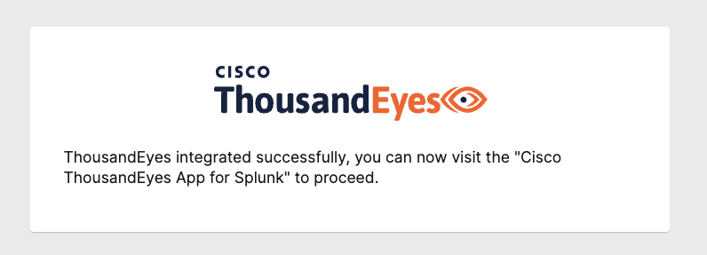
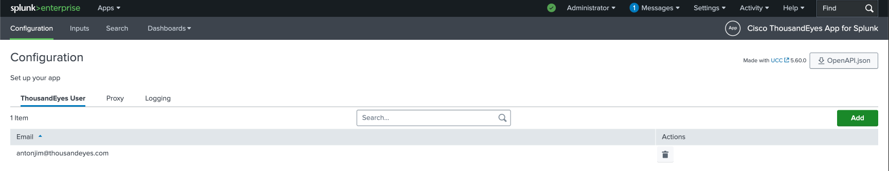

# Authenticate the ThousandEyes User

"This is the first step in configuring the ThousandEyes App for Splunk. To start ingesting ThousandEyes data, you first need to authenticate your ThousandEyes user in the app.

- Open `Cisco ThousandEyes App for Splunk`
- Navigate to `Configuration` -> `ThousandEyes User`
- Click `Add ThousandEyes User`
- Click `Authorize`
- Enter your ThousandEyes username and password and click `Login`
- On the authorization page, click `Confirm`
- You should see the following message:

    

- Once you are back in the Splunk app, click `Add`
- You should now see your ThousandEyes user in the list now

