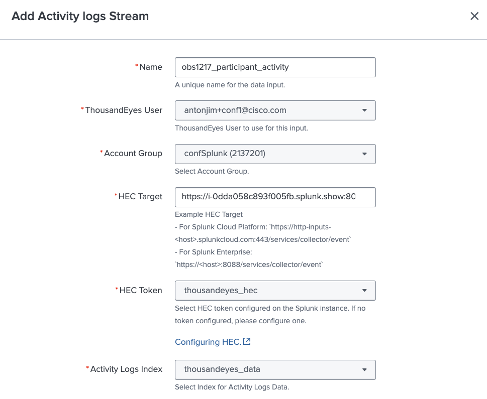
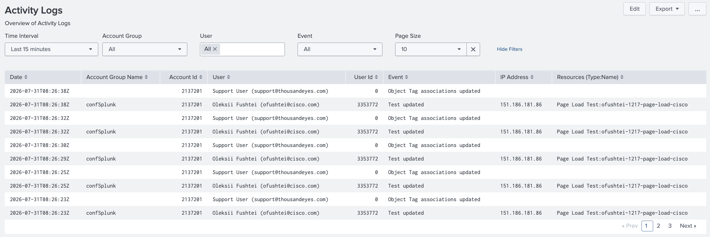

# Create Activity Log Input

## Configure Activity Log input

To configure ThousandEyes Activity Log stream, follow these steps:

- From the Splunk App, go to `Inputs` section
- Click `Create New Input`, select `Activity logs Stream`
- Fill the form:
    - Name: enter a unique name for your input
    - ThousandEyes User: select your user
    - Account Group: select your account group
    - HEC Target: enter the HEC target of your Splunk instance. Example: `https://<host>:8088/services/collector/event`
    - HEC Token: select `thousandeyes_hec`
    - Activity logs Index: select `thousandeyes_data`

## Generate activity in ThousandEyes

For the dashboard to have data, we need to generate activities in the ThousandEyes platform, for example:
  - Log In to the ThousandEyes platform
  - Create a test
  - Update a test
  - Logout from the ThousandEyes platform

## View Activity Log Dashboards

- Generate some activity logs in ThousandEyes by creating/deleting tests.
- In the `Dashboards` section, select `Activity Log` 

!!! note "Data may not be ready - Wait a few minutes"
    The telemetry needs to be generated by the application and send to Splunk. This may take a few minutes.

