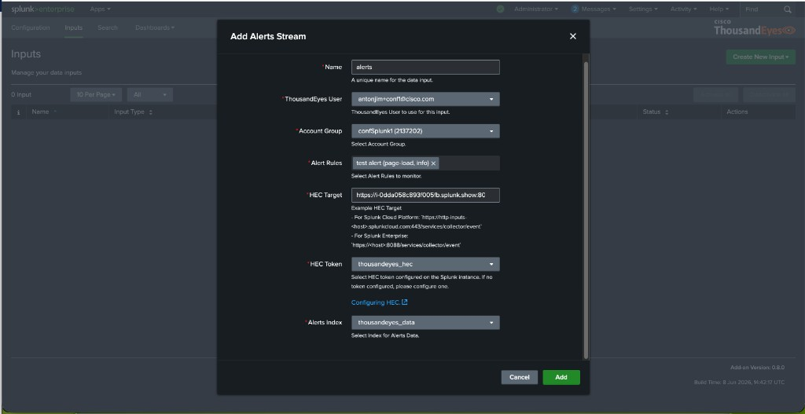
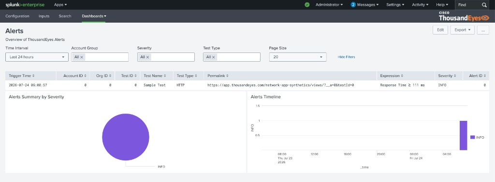

# Create Alerts Input

## Configure Alerts input

To configure the ThousandEyes Alerts stream, follow these steps:

- From the Splunk App, go to the `Inputs` section
- Click `Create New Input` and select `Activity logs Stream`
- Fill out the form:
    - Name: Enter a unique name for your input
    - ThousandEyes User: Select your user
    - Account Group: Select your account group
    - Alert Rules: Select one or more alert rules to enable webhook notifications
    - HEC Target: Enter the HEC target of your Splunk instance. Example: `https://<host>:8088/services/collector/event`
    - HEC Token: Select `thousandeyes_hec`
    - Alerts Index: Select `thousandeyes_data`
- Click `Add`

!!! note "Automatic webhook configuration"
    The app creates a ThousandEyes webhook operation and a Splunk HEC connector, links them, and updates the selected alert rules to use the webhook for notifications.

## View the Alerts Dashboard

- Trigger an alert for one of the selected alert rules.
- In the `Dashboards` section, select `Alerts`.

!!! note "Data may not be ready - Wait a few minutes"
    The alert must be triggered and sent to Splunk before it appears on the dashboard. This may take a few minutes.

