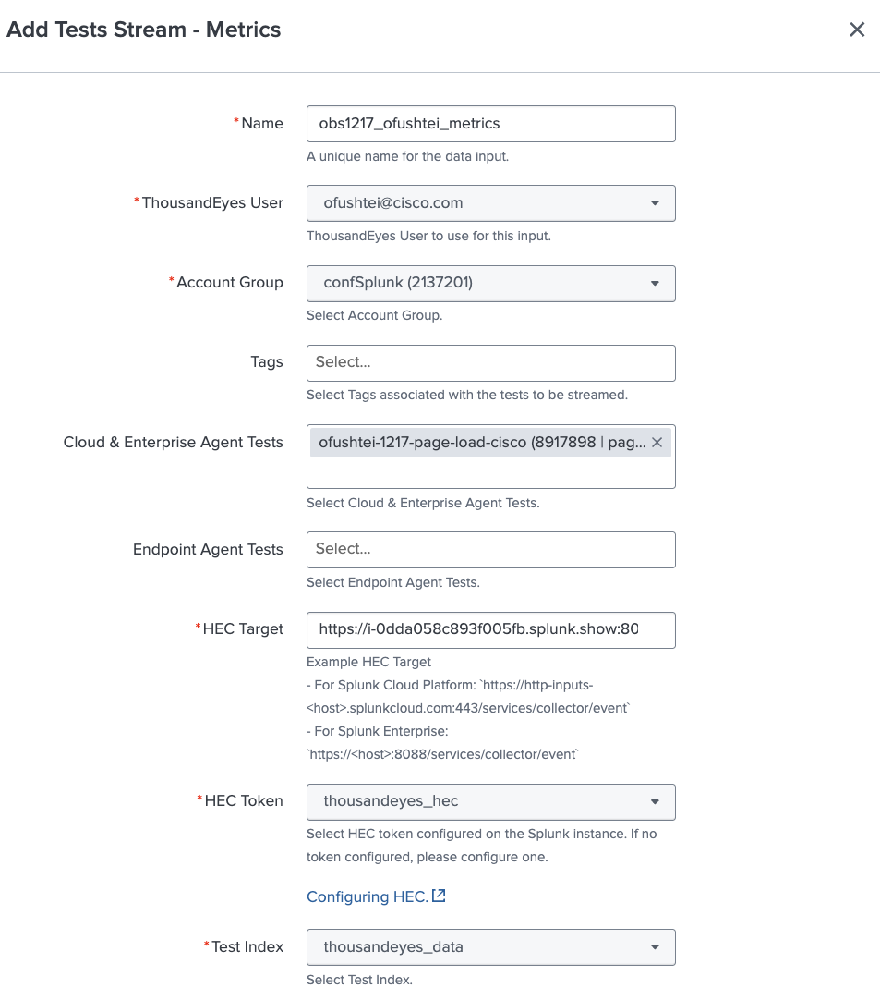

# Create Metrics Stream Input

## Configure Test Metrics Stream input

To configure the ThousandEyes Test Metrics stream, follow these steps:

- From the Splunk App, to go the `Inputs` section
- Click `Create New Input` and select `Test Stream - Metrics`
- Fill out the form:
    - Name: Enter a unique name for your input
    - ThousandEyes User: Select your user
    - Account Group: Select your account group
    - HEC Target: Enter the HEC target of your Splunk instance. Example: `https://<host>:8088/services/collector/event`
    - Cloud & Enterprise Agent Tests: Select your ThousandEyes Test
    - HEC Token: Select `thousandeyes_hec`
    - Test Index: Select `thousandeyes_data`
- Click `Add`

## View Network and Application Dashboards

- In the `Dashboards` section, select `Network` 

- In the `Dashboards` section, select `Application`

!!! note "Data may not be ready - Wait a few minutes"
    The telemetry needs to be generated by the application and sent to Splunk. This may take a few minutes.

